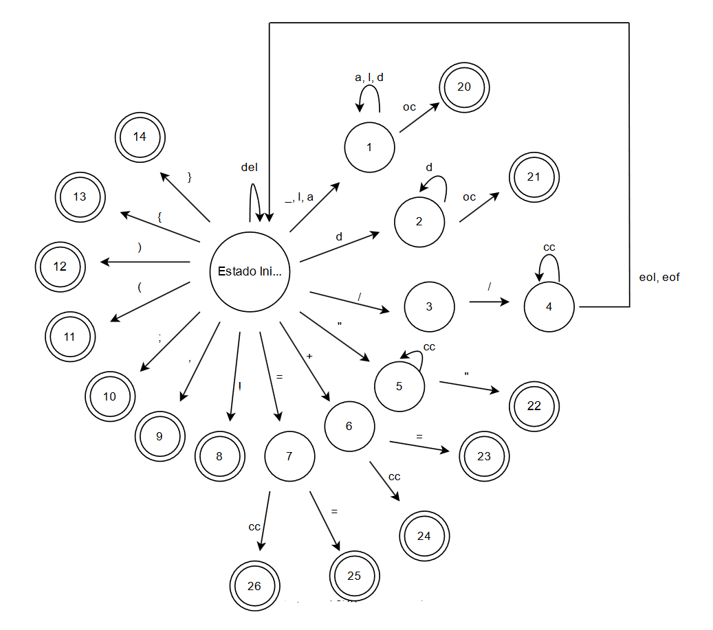
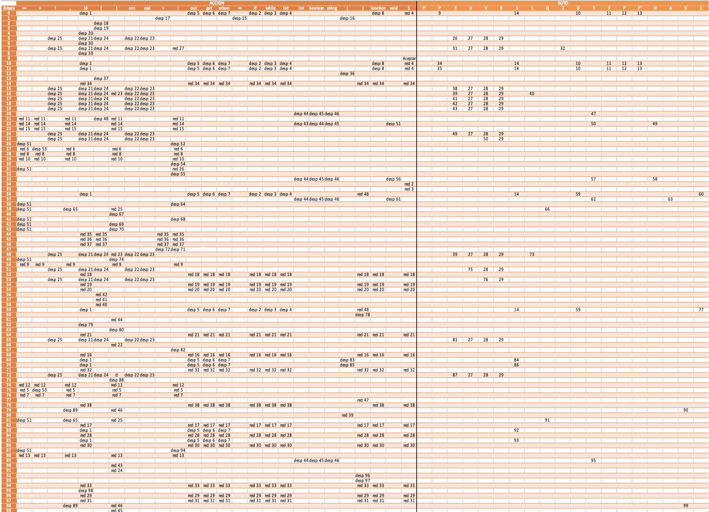

# Procesador de Lenguaje JS-PdL

## Índice

- [Procesador de Lenguaje JS-PdL](#procesador-de-lenguaje-js-pdl)
  - [Índice](#índice)
  - [Introducción](#introducción)
    - [Autor](#autor)
    - [Opciones de la Práctica](#opciones-de-la-práctica)
  - [Analizador léxico](#analizador-léxico)
    - [Tokens](#tokens)
    - [Gramática Regular](#gramática-regular)
    - [Autómata Finito Determinista](#autómata-finito-determinista)
    - [Acciones semánticas](#acciones-semánticas)
  - [Analizador Sintáctico](#analizador-sintáctico)
    - [Gramática Analizador Sintáctico](#gramática-analizador-sintáctico)
    - [Tablas Acción y GOTO](#tablas-acción-y-goto)
  - [Análisis semántico](#análisis-semántico)
  - [Tabla de Simbolos](#tabla-de-simbolos)
    - [Tabla](#tabla)
    - [Símbolo](#símbolo)
  - [Gestor de errores](#gestor-de-errores)
    - [Formato de errores](#formato-de-errores)
    - [Tipos de Errores y Mensajes](#tipos-de-errores-y-mensajes)
  - [Anexo - Casos de Prueba](#anexo---casos-de-prueba)


<div style="page-break-after: always;"></div>

## Introducción

Este proyecto ha sido desarrollado para la asignatura **Procesadores de Lenguajes** en la **Universidad Politécnica de Madrid** durante el curso 2023-24. 

El programa implementa un procesador de lenguaje para el lenguaje **JS-PdL**, una variante de JavaScript diseñada específicamente para la práctica de esta asignatura. Cabe destacar que las características de JS-PdL no coinciden al 100% con el estándar de JavaScript, ya que es una versión simplificada de éste.

### Autores

- **Nombre**: Juan Francisco Casanova Ferrer
- **Matrícula**: b190340
- **Email**: jf.casanova@alumnos.upm.es

--

- **Nombre**: Mario Aparicio Magdalena
- **Matrícula**: b190339
- **Email**: mario.aparicio.magdalena@alumnos.upm.es

### Opciones de la Práctica

Además de las funcionalidades comunes para todos los grupos, las opciones obligatorias para esta práctica son:

- **Sentencias**: Sentencia repetitiva (`while`)
- **Operadores especiales**: Asignación con suma (`+=`)
- **Técnicas de Análisis Sintáctico**: Ascendente LR
- **Comentarios**: Comentario de línea (`//`)
- **Cadenas**: Con comillas dobles (`" "`)

<div style="page-break-after: always;"></div>

## Analizador léxico

### Tokens

En el analizador léxico, los tokens son las unidades léxicas más pequeñas e indivisibles con significado en el lenguaje. 

En esta implementación, los tokens están formados por la tupla **<TipoToken, atributo>**.

A continuación se describen los tokens utilizados en el lenguaje JS-PdL:

- <Suma, - >
- <Negación, - >
- <coma, ->
- <Puntocoma, ->
- <AbreParentesis, ->
- <CierraParentesis, ->
- <AbreCorchete, ->
- <CierraCorchete, ->
- <Asignacion, ->
- <Comparador, - >
- <AsignacionSuma, - >
- <FinDeFichero, - >
- <Entero, valor>
- <ID, posicionTS>
- <Cadena, lexema>
- <PalabraReservada, lexema>

Los posibles lexemas para las palabras reservadas son: 
- ‘int’
- ‘boolean’
- ‘string’
- ‘void’
- ‘function’
- ‘return’
- ‘get’
- ‘put’
- ‘if’
- ‘while’
- ‘let’

<div style="page-break-after: always;"></div>

### Gramática Regular

S → del S | l A | a A | d B | / C | “ D | , | ; | ( | ) | { | } | + E | = F | ! | _ A

A → l A | d A | a A | _ A | oc

B → d B | oc

C → / C’

C’ → cc C’ | eof S

D → cc D | “

E → = | cc

F → = | cc

- del: {espacio, tabulador}
- l:  {a, b, …, z}
- a:  {A, B, …, Z}
- d:  {0, 1, …, 9}
- f:  {eof, eol}
- cc: cualquier carácter
- oc: cualquier otro carácter menos los usados en el estado anterior

<div style="page-break-after: always;"></div>

### Autómata Finito Determinista

  

<div style="page-break-after: always;"></div>

### Acciones semánticas

Todos los caracteres no contemplados en los estados son considerados errores.

- **0:0**: Leer; `cont1 = 0`
- **0:1**: `lexema = l`; Leer
- **1:1**: `lexema = lexema ⊕ l`; Leer  
  - IF `cont1 > 64` THEN 
    error("Cadena demasiado larga", `línea`, `lexema`)
- **1:20**:  
  - IF `lexema ∈ TSactiva | TSglobal` THEN 
    error("El lexema pertenece a la tabla de símbolos", `línea`, `lexema`)
  - ELSE IF `lexema ∈ Tabla_PalRes` THEN `GenToken(PalRes, lexema)`
  - ELSE `GenToken(id, posTS)` 
- **0:2**: `valor = valor_ascii(d)`; Leer
- **2:2**: `valor = valor * 10 + valor_ascii(d)`; Leer  
  - IF `valor > 32767` THEN 
    error("Se ha superado el valor numérico máximo")
- **2:21**: `GenToken(CteEntera, valor)` 
- **0:3**: Leer 
- **3:4**: Leer
- **4:4**: Leer
- **4:0**: Leer
- **0:5**: `lexema = l`; Leer; `cont2 = 0`
- **5:5**: `lexema = lexema ⊕ l`; Leer; `cont2++`  
  - IF `cont2 > 64` THEN 
    error("Cadena demasiado larga", `línea`, `lexema`)
- **5:22**: `lexema = lexema ⊕ l`; `GenToken(cadena, lexema)`; Leer
- **0:6**: Leer
- **6:23**: `lexema = lexema ⊕ l`; `GenToken(asignaciónSuma, lexema)`; Leer 
- **6:24**: `GenToken(suma, lexema)`
- **0:7**: Leer
- **7:25**: `GenToken(==, -)`; Leer
- **7:26**: `GenToken(asignación, lexema)`
- **0:8**: `GenToken(negación, lexema)`; Leer
- **0:9**: `GenToken(coma, -)`; Leer
- **0:10**: `GenToken(puntocoma, -)`; Leer
- **0:11**: `GenToken(abroparentesis, -)`; Leer
- **0:12**: `GenToken(cierroparentesis, -)`; Leer
- **0:13**: `GenToken(abrocorchete, -)`; Leer
- **0:14**: `GenToken(cierrocorchete, -)`; Leer

<div style="page-break-after: always;"></div>

## Analizador Sintáctico

Se ha implementado un **analizador sintáctico ascendente**. 

Para este tipo de analizador no es necesario comprobar la condición LL1 ni la condición de recursividad por la izquierda.

### Gramática Analizador Sintáctico

```Java

    0 $accept: P $end

    1 P: B P
    2  | F P
    3  | ε

    4 B: IF '(' E ')' S
    5  | WHILE '(' E ')' '{' C '}'
    6  | LET ID T ';'
    7  | LET ID T '=' E ';'
    8  | S

    9 T: INT
   10  | BOOLEAN
   11  | STRING

   12 F: F1 '{' C '}'

   13 F1: F2 '(' A ')'

   14 F2: FUNCTION ID H

   15 H: T
   16  | VOID

   17 A: T ID K
   18  | VOID

   19 K: ',' T ID K
   20  | ε

   21 C: B C
   22  | ε

   23 E: E EQ_OP U
   24  | U

   25 U: U '+' V
   26  | V

   27 V: '!' W
   28  | W

   29 W: ID
   30  | '(' E ')'
   31  | ID '(' L ')'
   32  | ENTERO
   33  | CADENA

   34 S: ID '=' E ';'
   35  | ID ADD_OP E ';'
   36  | ID '(' L ')' ';'
   37  | PUT E ';'
   38  | GET ID ';'
   39  | RETURN Z ';'

   40 L: E Q
   41  | ε

   42 Q: ',' E Q
   43  | ε

   44 Z: E
   45  | ε

```

<div style="page-break-after: always;"></div>

### Tablas Acción y GOTO

Para las tablas de ACCIÓN y GOTO se han utilizado los estados proporcionados por la herramienta Bison. La gramática es LR1, solo hay una regla en cada celda y no hay filas vacías.

  

<div style="page-break-after: always;"></div>

## Análisis semántico

Se encarga de controlar los tipados, operaciones de flujo y administra los símbolos introducido por el léxico a la tabla de símbolos. Evalúa una a una las reglas generadas por el analizador sintáctico.

A continuación, se muestra cómo gestiona el analizador semantico las reglas recibidas, tomando como referencia la [gramática del analizador sintáctico](#gramática-analizador-sintáctico):

#### Inicialización

- `’ → P`: 
  ``` 
  {
    TS_Global = Crear_TS(),
    TS_Global.desp = 0,
    TS_Activa = TS_Global(),
    Destruir_TS()
  }
  ```

#### Producciones de P

- `P → BP`: `{ }`
- `P → FP`: `{ }`
- `P → λ`: `{ }`

#### Producciones de E

- `E → E == U`: 
  ```
  {
    E.tipo := if (E1.tipo == U.tipo == Tipo.INT) then
      Tipo.BOOLEAN
    else
      GestorErrores.lanzarError("No coinciden los tipos en la expresión E == U")
  }
  ```
- `E → U`: `{ }`

<div style="page-break-after: always;"></div>

#### Producciones de U

- `U → U + V`: 
  ```
  {
    U.tipo := if (U1.tipo == V.tipo == Tipo.INT) then
      Tipo.INT
    else
      GestorErrores.lanzarError("No coinciden los tipos de la expresión U + V")
  }
  ```
- `U → V`: `{ }`

#### Producciones de V

- `V → ! W`: 
  ```
  {
    V.tipo := if (W.tipo == Tipo.BOOLEAN) then
      Tipo.BOOLEAN
    else
      GestorErrores.lanzarError("No coinciden los tipos de la expresión !W")
  }
  ```
- `V → W`: `{ V.tipo := W.tipo }`

#### Producciones de W

- `W → id`: 
  ```
  {
    W.tipo := buscatipoTS(id.pos)
  }
  ```
- `W → ( E )`: 
  ```
  {
    W.tipo := if (E.tipo == Tipo.INT || E.tipo == Tipo.BOOLEAN) then
      E.tipo
    else
      GestorErrores.lanzarError("Tipo de la expresión W(E) incorrecto")
  }
  ```
- `W → id ( L )`: 
  ```
  {
    W.tipo := buscatipoTS(id.pos)
  }
  ```
- `W → ent`: 
  ```
  {
    W.tipo = Tipo.INT,
    W.ancho = 2
  }
  ```
- `W → cad`: 
  ```
  {
    W.tipo = Tipo.STRING,
    W.ancho = 128
  }
  ```

#### Producciones de S

- `S → id = E;`: 
  ```
  {
    S.tipo := if (buscatipoTS(id.pos) == E.tipo) then
      Tipo.OK
    else
      GestorErrores.lanzarError("El tipo del identificador no coincide con la expresión")
  }
  ```
- `S → id ( L );`: 
  ```
  {
    S.tipo := buscatipoTS(id.pos)
  }
  ```

<div style="page-break-after: always;"></div>

- `S → put E;`: 
  ```
  {
    S.tipo := if (E.tipo == Tipo.INT || E.tipo == Tipo.STRING) then
      Tipo.OK
    else
      GestorErrores.lanzarError("Tipo de la expresión es incorrecto para mostrar")
  }
  ```
- `S → get id;`: 
  ```
  {
    S.tipo := if (buscatipoTS(id.pos) == Tipo.INT || buscatipoTS(id.pos) == Tipo.STRING) then
      buscatipoTS(id.pos)
    else
      GestorErrores.lanzarError("No se puede obtener el identificador, tipo erróneo")
  }
  ```
- `S → return Z;`: 
  ```
  {
    S.tipoRetorno := Z.tipo
  }
  ```
- `S → id += E;`: 
  ```
  {
    S.tipo := if (buscatipoTS(id.pos) == E.tipo) then
      Tipo.OK
    else
      GestorErrores.lanzarError("El tipo del identificador no coincide con la expresión")
  }
  ```

<div style="page-break-after: always;"></div>

#### Producciones de L

- `L → EQ`: `{ }`
- `L → λ`: `{ }`

#### Producciones de Q

- `Q → , EQ`: `{ }`
- `Q → λ`: `{ }`

#### Producciones de Z

- `Z → E`: `{ }`
- `Z → λ`: `{ }`

#### Producciones de B

- `B → if ( E ) S`: 
  ```
  {
    B.tipo := if (E.tipo == Tipo.BOOLEAN) then
      S.tipo
    else
      GestorErrores.lanzarError("El tipo de la expresión evaluada es erróneo")
  }
  ```

- `B → if ( E ) { S }`: 
  ```
  {
    B.tipo := if (E.tipo == Tipo.BOOLEAN) then
      S.tipo
    else
      GestorErrores.lanzarError("El tipo de la expresión evaluada es erróneo")
  }
  ```
- `B → while ( E ) S`: 
  ```
  {
    B.tipo := if (E.tipo == Tipo.BOOLEAN) then
      S.tipo
    else
      GestorErrores.lanzarError("El tipo de la expresión evaluada es erróneo")
  }
  ```

<div style="page-break-after: always;"></div>

- `B → while ( E ) { S }`: 
  ```
  {
    B.tipo := if (E.tipo == Tipo.BOOLEAN) then
      S.tipo
    else
      GestorErrores.lanzarError("El tipo de la expresión evaluada es erróneo")
  }
  ```
- `B → let id T;`: 
  ```
  {
    B.tipo := if (asignartipoTS(id.pos, T.tipo), aumentarDespla(T.ancho)) then
      Tipo.OK
  }
  ```
- `B → let id T = E;`: 
  ```
  {
    B.tipo := if (T.tipo == E.tipo) then
      asignartipoTS(id.pos, T.tipo), aumentarDespla(T.ancho),
      Tipo.OK
    else
      GestorErrores.lanzarError("No coinciden los tipos de T y la expresión")
  }
  ```
- `B → S`: 
  ```
  {
    B.tipoRetorno := S.TipoRetorno
  }
  ```

<div style="page-break-after: always;"></div>

#### Producciones de T

- `T → int`: 
  ```
  {
    T.tipo = Tipo.INT,
    T.ancho = 2
  }
  ```
- `T → boolean`: 
  ```
  {
    T.tipo = Tipo.BOOLEAN,
    T.ancho = 2
  }
  ```
- `T → string`: 
  ```
  {
    T.tipo = Tipo.STRING,
    T.ancho = 128
  }
  ```

#### Producciones de F

- `F → F’ { C }`: 
  ```
  {
    if (F’.tipo != C.tipoRetorno) then
      GestorErrores.lanzarError("No coinciden los tipos de retorno")
  }
  ```
- `F’ → F” ( A )`: 
  ```
  {
    zona_dec = false,
    rellenarAtributosid(listaparam),
    F’.tipo := F”.tipo
  }
  ```

<div style="page-break-after: always;"></div>

- `F” → function id H`: 
  ```
  {
    F”.tipo := H.tipo,
    insertarTS(id.pos, Tipo.function),
    zona_dec = true
  }
  ```

#### Producciones de H

- `H → T`: 
  ```
  {
    H.tipo := T.tipo
  }
  ```
- `H → void`: 
  ```
  {
    T.tipo = Tipo.VOID
  }
  ```

#### Producciones de A

- `A → T id K`: 
  ```
  {
    if (buscatipoTS(id.pos) == T.tipo) then
      insertatipoTS(id.pos, T.tipo),
      A.tipo = T.tipo
    else
      GestorErrores.lanzarError("El tipo del identificador no se corresponde con ninguno que exista")
  }
  ```
- `A → void`: `{ }`

<div style="page-break-after: always;"></div>

#### Producciones de K

- `K → , T id K`: 
  ```
  {
    if (buscatipoTS(id.pos) == T.tipo) then
      insertatipoTS(id.pos, T.tipo),
      A.tipo = T.tipo
    else
      GestorErrores.lanzarError("El tipo del identificador no se corresponde con ninguno que exista")
  }
  ```
- `K → λ`: `{ }`

#### Producciones de C

- `C → BC`: `{ }`
- `C → λ`: `{ C.tipo = Tipo.OK }`

<div style="page-break-after: always;"></div>

## Tabla de Simbolos

Se ha utilizado el siguiente diseño para la creación de las tablas de símbolos:

Cada tabla de símbolos está formada por:

### Tabla

- **Tabla**: `<Posicion, Simbolo>`
  - Es un mapa que relaciona una posición con un símbolo. Cada entrada de la tabla se corresponde con un símbolo del programa, lo que permite un acceso rápido y eficiente a la información asociada a cada identificador.
- **Número de la tabla**
  - Un identificador único para cada tabla de símbolos, utilizado para diferenciar entre diferentes contextos, como funciones o bloques de código.
- **Desplazamiento acumulado**
  - El desplazamiento acumulado dentro de la tabla, que ayuda a calcular las direcciones de memoria relativas para los símbolos almacenados.

### Símbolo

- **Lexema**
  - El nombre o identificador del símbolo, como el nombre de una variable o función.
- **Tipo**
  - El tipo del símbolo, que puede ser un tipo de dato primitivo ( `int`, `boolean`, `string`, o `void`).
- **Desplazamiento**
  - La posición relativa del símbolo dentro del ámbito de la tabla de símbolos. Se utiliza para calcular la dirección de memoria del símbolo durante la ejecución.
- **Ancho**
  - La cantidad de memoria en bytes que ocupa el símbolo. `boolean` e `int` ocupan 2 bytes, mientras que  `string` ocupa 128.
- **Número de parámetros**
  - Para las funciones, este campo indica cuántos parámetros recibe la función.
- **Tipo de parámetros**
  - Una lista que especifica los tipos de cada uno de los parámetros que recibe una función. Esto es crucial para la verificación de tipos durante las llamadas a funciones.
- **Tipo de retorno**
  - El tipo de dato que la función devuelve. Esto asegura que las funciones se utilicen correctamente dentro del código, respetando el tipo de retorno esperado.

<div style="page-break-after: always;"></div>

## Gestor de errores

### Formato de Errores

Se ha implementado la clase `GestorErrores` para gestionar los errores. Los errores se muestran en el siguiente formato:

``` Java
"Error " + tipo + ": " + mensaje + " en linea " + linea
```

### Tipos de Errores y Mensajes

##### Errores Léxicos

- **PALABRA_RESERVADA_MINUS**: Las palabras reservadas deben ser escritas en minúsculas.
- **CADENA_LARGA**: Cadena demasiado larga.
- **CADENA_SALTO_LINEA**: Cadena no puede contener salto de línea.
- **ENTERO_MAXIMO**: Se ha superado el valor numérico máximo.
- **CARACTER_NO_ESPERADO_COMENTARIO**: Carácter no esperado. Se esperaba `/`.
- **CARACTER_NO_ESPERADO**: Error al procesar el carácter actual.
- **ESTADO_FINAL_NO_MANEJADO**: Estado final no manejado.

##### Errores Sintácticos

- **TOKEN_NO_ESPERADO**: Token no esperado.

##### Errores Semánticos

- **TIPO_BOOLEAN**: La expresión debería ser de tipo booleano.
- **TIPOS_NO_COINCIDEN**: Los tipos de la expresión no coinciden.
- **TIPO_NO_COMPATIBLE**: Tipo de la expresión no compatible.
- **LLAMADA_FUNCION_NO_DECLARADA**: Se está haciendo una llamada a una función no declarada.
- **VARIABLE_REDECLARADA**: Se está redeclarando una variable.
- **TIPO_RETORNO_FUNCION**: El tipo de retorno de la función y el tipo de la función no coinciden.
- **NUMERO_PARAMETROS**: El número de parámetros no coincide con los de la función.
- **TIPO_PARAMETROS**: Los tipos de parámetros no coinciden con los de la función.
- **REGLA_NO_IMPLEMENTADA**: Se ha recibido una regla no esperada.

##### Errores Genéricos

Estos errores se producen por problemas generales no específicos de una etapa del análisis. Los mensajes de error genéricos incluyen:

- **ARCHIVO_GRAMATICA_NO_ENCONTRADO**: El archivo de gramatica.output no se ha encontrado (directorio resources).

<div style="page-break-after: always;"></div>

## Anexo - Casos de Prueba

### Índice de Anexos
- [Anexo 1: Caso de prueba 1 (correcto)](#caso-1---correcto)
- [Anexo 2: Caso de prueba 2 (correcto)](#caso-2---correcto)
- [Anexo 3: Caso de prueba 3 (correcto)](#caso-3---correcto)
- [Anexo 4: Caso de prueba 4 (correcto)](#caso-4---correcto)
- [Anexo 5: Caso de prueba 5 (correcto)](#caso-5---correcto)
- [Anexo 6: Caso de prueba 6 (incorrecto)](#caso-6---incorrecto)
- [Anexo 7: Caso de prueba 7 (incorrecto)](#caso-7---incorrecto)
- [Anexo 8: Caso de prueba 8 (incorrecto)](#caso-8---incorrecto)
- [Anexo 9: Caso de prueba 9 (incorrecto)](#caso-9---incorrecto)
- [Anexo 10: Caso de prueba 10 (incorrecto)](#caso-10---incorrecto)

### Árbol Sintáctico de los casos de prueba correctos:
Los árboles sintácticos se proporcionan en el fichero adjunto para su visualización.

<div style="page-break-after: always;"></div>

### Caso 1 - Correcto

```javascript
let x string = "lexema";
function nombre1 boolean(string cadena) {
    let y int = 2;
    if (y == 4) {
        put cadena;
    }
    return (y == 4);
}
```

**Fichero de tokens:**
```
<PALABRARESERVADA, let>
<ID, 0>
<PALABRARESERVADA, string>
<ASIGNACION, >
<CADENA, "lexema">
<PUNTOCOMA, >
<PALABRARESERVADA, function>
<ID, 1>
<PALABRARESERVADA, boolean>
<ABREPARENTESIS, >
<PALABRARESERVADA, string>
<ID, 0>
<CIERRAPARENTESIS, >
<ABRECORCHETE, >
<PALABRARESERVADA, let>
<ID, 1>
<PALABRARESERVADA, int>
<ASIGNACION, >
<ENTERO, 2>
<PUNTOCOMA, >
<PALABRARESERVADA, if>
<ABREPARENTESIS, >
<ID, 1>
<COMPARADOR, >
<ENTERO, 4>
<CIERRAPARENTESIS, >
<ABRECORCHETE, >
<PALABRARESERVADA, put>
<ID, 0>
<PUNTOCOMA, >
<CIERRACORCHETE, >
<PALABRARESERVADA, return>
<ABREPARENTESIS, >
<ID, 1>
<COMPARADOR, >
<ENTERO, 4>
<CIERRAPARENTESIS, >
<PUNTOCOMA, >
<CIERRACORCHETE, >
<FINDEFICHERO, >
```

**Tabla de Símbolos:**
```
CONTENIDOS DE LA TABLA #1:
* LEXEMA : 'cadena'
  - tipo: 'STRING'
  - despl: 0
* LEXEMA : 'y'
  - tipo: 'INT'
  - despl: 128

CONTENIDOS DE LA TABLA #0:
* LEXEMA : 'x'
  - tipo: 'STRING'
  - despl: 0
* LEXEMA : 'nombre1'
  - tipo: 'FUNCTION'
  - numParam: '1'
  - TipoParam0: 'STRING'
  - ModoParam0: 'VALOR'
  - TipoRetorno: 'BOOLEAN'
  - EtiqFuncion: 'nombre1'
```

<div style="page-break-after: always;"></div>

### Caso 2 - Correcto

```javascript
let x int = 0;
let y int = 3;
while (x < y) {
    x += 1;
    put x;
}
```

**Fichero de tokens:**
```
<PALABRARESERVADA, let>
<ID, 0>
<PALABRARESERVADA, int>
<ASIGNACION, >
<ENTERO, 0>
<PUNTOCOMA, >
<PALABRARESERVADA, let>
<ID, 1>
<PALABRARESERVADA, int>
<ASIGNACION, >
<ENTERO, 3>
<PUNTOCOMA, >
<PALABRARESERVADA, while>
<ABREPARENTESIS, >
<ID, 0>
<COMPARADOR, >
<ID, 1>
<CIERRAPARENTESIS, >
<ABRECORCHETE, >
<PALABRARESERVADA, put>
<ID, 0>
<PUNTOCOMA, >
<CIERRACORCHETE, >
<FINDEFICHERO, >
```

**Tabla de Símbolos:**
```
CONTENIDOS DE LA TABLA #0:
* LEXEMA : 'x'
  - tipo: 'INT'
  - despl: 0
* LEXEMA : 'y'
  - tipo: 'INT'
  - despl: 2
```

<div style="page-break-after: always;"></div>

### Caso 3 - Correcto

```javascript
let id boolean = (6 == 2);
function fun boolean(boolean ejemplo) {
    let aux boolean = ejemplo;
    return aux;
}
```

**Fichero de tokens:**
```
<PALABRARESERVADA, let>
<ID, 0>
<PALABRARESERVADA, boolean>
<ASIGNACION, >
<ABREPARENTESIS, >
<ENTERO, 6>
<COMPARADOR, >
<ENTERO, 2>
<CIERRAPARENTESIS, >
<PUNTOCOMA, >
<PALABRARESERVADA, function>
<ID, 1>
<PALABRARESERVADA, boolean>
<ABREPARENTESIS, >
<PALABRARESERVADA, boolean>
<ID, 0>
<CIERRAPARENTESIS, >
<ABRECORCHETE, >
<PALABRARESERVADA, let>
<ID, 1>
<PALABRARESERVADA, boolean>
<ASIGNACION, >
<ID, 0>
<PUNTOCOMA, >
<PALABRARESERVADA, return>
<ID, 1>
<PUNTOCOMA, >
<CIERRACORCHETE, >
<FINDEFICHERO, >
```

<div style="page-break-after: always;"></div>

**Tabla de Símbolos:**
```
CONTENIDOS DE LA TABLA #1:
* LEXEMA : 'ejemplo'
  - tipo: 'BOOLEAN'
  - despl: 0
* LEXEMA : 'aux'
  - tipo: 'BOOLEAN'
  - despl: 2

CONTENIDOS DE LA TABLA #0:
* LEXEMA : 'id'
  - tipo: 'BOOLEAN'
  - despl: 0
* LEXEMA : 'fun'
  - tipo: 'FUNCTION'
  - numParam: '1'
  - TipoParam0: 'BOOLEAN'
  - ModoParam0: 'VALOR'
  - TipoRetorno: 'BOOLEAN'
  - EtiqFuncion: 'fun'
```

<div style="page-break-after: always;"></div>

### Caso 4 - Correcto

```javascript
let id int;
let id2 string;
if (id == 1)
    put id2;
get id2;
```

**Fichero de tokens:**
```
<PALABRARESERVADA, let>
<ID, 0>
<PALABRARESERVADA, int>
<PUNTOCOMA, >
<PALABRARESERVADA, let>
<ID, 1>
<PALABRARESERVADA, string>
<PUNTOCOMA, >
<PALABRARESERVADA, if>
<ABREPARENTESIS, >
<ID, 0>
<COMPARADOR, >
<ENTERO, 1>
<CIERRAPARENTESIS, >
<PALABRARESERVADA, put>
<ID, 1>
<PUNTOCOMA, >
<PALABRARESERVADA, get>
<ID, 1>
<PUNTOCOMA, >
<FINDEFICHERO, >
```

**Tabla de Símbolos:**
```
CONTENIDOS DE LA TABLA #0:
* LEXEMA : 'id'
  - tipo: 'INT'
  - despl: 0
* LEXEMA : 'id2'
  - tipo: 'STRING'
  - despl: 2
```

<div style="page-break-after: always;"></div>

### Caso 5 - Correcto

```javascript
function nombre1 int(string cadena) {
    let y int = 2;
    if (y == 4) {
        put cadena;
    }
    return y;
}
```

**Fichero de tokens:**
```
<PALABRARESERVADA, function>
<ID, 0>
<PALABRARESERVADA, int>
<ABREPARENTESIS, >
<PALABRARESERVADA, string>
<ID, 0>
<CIERRAPARENTESIS, >
<ABRECORCHETE, >
<PALABRARESERVADA, let>
<ID, 1>
<PALABRARESERVADA, int>
<ASIGNACION, >
<ENTERO, 2>
<PUNTOCOMA, >
<PALABRARESERVADA, if>
<ABREPARENTESIS, >
<ID, 1>
<COMPARADOR, >
<ENTERO, 4>
<CIERRAPARENTESIS, >
<ABRECORCHETE, >
<PALABRARESERVADA, put>
<ID, 0>
<PUNTOCOMA, >
<CIERRACORCHETE, >
<PALABRARESERVADA, return>
<ID, 1>
<PUNTOCOMA, >
<CIERRACORCHETE, >
<FINDEFICHERO, >
```
<div style="page-break-after: always;"></div>

**Tabla de Símbolos:**
```
CONTENIDOS DE LA TABLA #1:
* LEXEMA : 'cadena'
  - tipo: 'STRING'
  - despl: 0
* LEXEMA : 'y'
  - tipo: 'INT'
  - despl: 128

CONTENIDOS DE LA TABLA #0:
* LEXEMA : 'nombre1'
  - tipo: 'FUNCTION'
  - numParam: '1'
  - TipoParam0: 'STRING'
  - ModoParam0: 'VALOR'
  - TipoRetorno: 'INT'
  - EtiqFuncion: 'nombre1'
```


<div style="page-break-after: always;"></div>

### Caso 6 - Incorrecto

```javascript
let id int = 6;
while (id == (6 + 1))
    return %;
put id;
```

**Error:**
```
Error léxico: Error al procesar el caracter actual: % en línea 7
```

### Caso 7 - Incorrecto

```javascript
let id int = 7;
if (id == (6 + 1)) {
    id += {5}
}
put id int;
```

**Error:**
```
Error sintáctico: Error de análisis sintáctico en el token ABRECORCHETE en línea 5
```

### Caso 8 - Incorrecto

```javascript
let id int;
function string nombrefun() {
    let dev string;
    return dev;
}
```

**Error:**
```
Error sintáctico: Error de análisis sintáctico en el token STRING en línea 4
```
<div style="page-break-after: always;"></div>

### Caso 9 - Incorrecto

```javascript
let id int;
let id2 string = "Hola";
if (id == id2)
    return id2;
```

**Error:**
```
Error semántico: Los tipos en la expresión no coinciden en línea 6
```


### Caso 10 - Incorrecto

```javascript
let id int;
function nombrefun int(int param) {
    if (param == 0)
        param += 5;
    let error string;
    return error;
}
```

**Error:**
```
Error semántico: Hay un error con el tipo de retorno de la función en línea 10
```